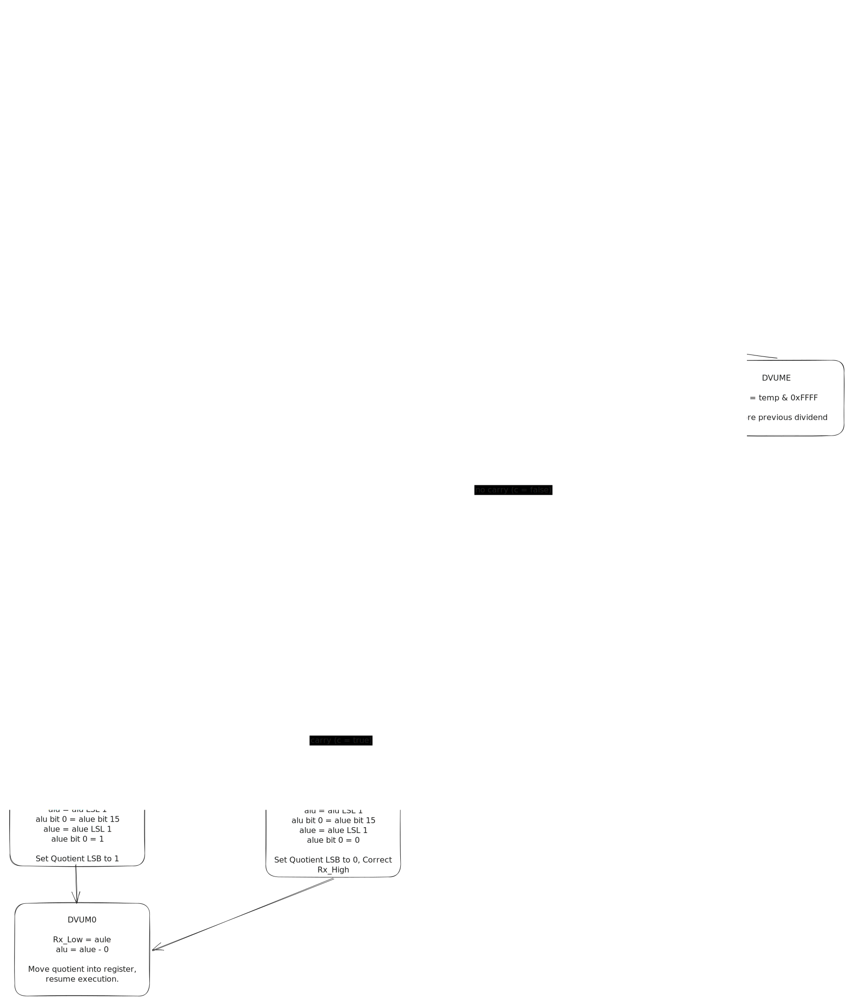

# 68000 unsigned division

## Table of Contents

1. [Introduction](#introduction)
2. [Tour of unsigned binary division](#tour-of-unsigned-binary-division)
3. [Outline of unsigned division in hardware](#outline-of-unsigned-division-in-hardware)
4. [Unsigned division microcode](#unsigned-division-microcode)
5. [Conclusion](#conclusion)

## Introduction

The purpose of this document is to attempt to explain the workings of the 68000 unsigned division algorithm and
infer the correct timing properties.

The 68000 supports dividing 32-bit unsigned integers by 16-bit unsigned integers.

The result is a 32-bit integer with the quotient in the lower 16-bits and the remainder in the upper 16-bits.

## Tour of unsigned binary division

Before proceeding, it makes a certain amount of sense to explain how division works in binary. 

It uses simplified version of the long division process used for decimal division.

For demonstration purposes let's divide 11 (binary: **1011**) by 3 (binary: **11**).

### Step 0

Let us present the division problem as follows with the divisor on the left and the dividend on the right.

```text
  _____
11)1011
```

### Step 1

**11** is greater than **1** (the most significant bit of the dividend). So we place a **0** as the quotient's most
significant bit.

```text
   0
  _____
11)1011
```

### Step 2

**11** is greater **10** (the two most significant bits of the dividend). So we place a **0** as the quotient's second
most significant bit.

```text
   00
  _____
11)1011
```

### Step 3

**11** is less than **101** (the three most significant bits of the dividend). So we place a **1** as the quotient's
third most significant bit and subtract **11** from **101**.

```text
   001
  _____
11)1011
  - 11
   ---
   010
```

and bring down the least significant bit of the dividend to be the least significant bit of the new remainder.

```text
   001
  _____
11)1011---+
  - 11    |
   ----   |
   0101 <-+
```

### Step 4

**11** is less than **101** (the new remainder). So we place a **1** as the quotient's least significant bit and
subtract **11** from **101** to compute the remainder.

```text
   0011
  _____
11)1011
  - 11
   ----
   0101
  -  11
   ----
   0010  
```

There we have it. Three divides eleven 3 (**0011**) times with remainder 2 (**0010**).

The principle is that we look for portions of the dividend that are greater than the
divisor and put a **1** in the quotient and subtract the divisor from the dividend.

## Outline of unsigned division in hardware

This section outlines how the 68000 does its unsigned division.

The first thing to note is that the 68000 only uses 16-bits for the quotient result.

This means that in order for the result to be valid

```text
DIVIDEND
-------- < 2 to the power of 16
DIVISOR
```

otherwise, unsigned overflow occurs. This can be restated as

```text
DIVIDEND < (DIVISOR LOGICAL SHIFT LEFT 16)
```

In order to make the following description relatively short we're going, for the sake of demonstration, make the 68000
a 4-bit processor and divide a 4-bit quantity by a 2-bit quantity. The quotient and remainder will then both require 2
bits.

We will again divide 11 (**1011**) by 3 (**11**).

### Step 0

We shift the divisor left logically by two bits and line them up against the dividend as follows

```text
DIVIDEND: 10|11  (Eleven)
DIVISOR:  11|00  (Three LOGICALLY SHIFTED LEFT twice)
QUOTIENT: 00|xx
```

Since the quotient must be less than 4 (see the overflow conditions above adapted for a 2-bit quotient) we know already
that the upper two bits of the 4-bit quotient must be zero. The first bit of the quotient we're trying to determine
is the third most significant.

### Step 1

If we recall from the section on long division the way we determined the value of the third most significant bit was to
subtract **11** from **101**. However, in the current set up the bits don't line up the way we expect so let's shift the
dividend logically to the left one bit.

```text
DIVIDEND: 101|10
DIVISOR:   11|00
QUOTIENT:  00|xx
``` 

Now that everything lines up nicely we have a problem; the dividend requires 5 bits, and we're a 4-bit processor.

Thankfully, there's a workaround. If, prior to the shift, the most significant bit of the dividend is **1** then shifted
5-bit dividend is guaranteed to have been greater than the divisor, so we can go ahead and shift the dividend left, 
subtract the divisor from the new 4-bit dividend and set appropriate quotient bit to **1**.

We then get,

```text
DIVIDEND: 10|10
DIVISOR:  11|00
QUOTIENT: 00|1x
```

(Note that **01** minus **11** is **10**)

### Step 2

If we recall from the step of the section on long division how we determined the least significant bit of the quotient,
we subtracted **11** from **101**. Again our setup doesn't quite look right and in order to repeat the step in hardware
we're going to need to shift the dividend to the left again.

Since the most significant bit of the dividend prior to the shift was **1** we can set the least significant bit
of the quotient to **1** and subtract the divisor from the shifted dividend to get the final remainder.

```text
DIVIDEND: 10|00 (upper two bits contain the remainder)
DIVISOR:  11|00
QUOTIENT: 00|11 (lower two bits contain the quotient).
```

And there we again have that three divides eleven 3 times remainder 2.

### Zero as most significant bit of dividend

If the most significant bit of the dividend is 0 then the situation might look like this

```text
DIVIDEND: 01|10
DIVISOR:  10|00
QUOTIENT: 00|xx
```

In this case we have to shift the dividend left one bit and check if this is greater than or equal to the divisor. If it
is, then set the appropriate quotient bit to **1** and subtract the divisor. If not, then set the appropriate quotient bit
to **0** and continue.

### Pseudocode

The algorithm can be summarised as, for the number of bits in the divisor:

1. Make a note of the most significant bit of the dividend
2. Shift the dividend left one bit
3. If the previous most significant bit was **1** or if the shifted dividend is greater than the divisor
    1. Set the relevant bit of the quotient to **1**
    2. Subtract the divisor from the dividend
4. Otherwise, set the relevant bit of the quotient to **0**

The pseudocode below outlines the algorithm described above.

```c++
auto DivideUnsigned(uint32_t dividend, uint16_t divisor) -> uint32_t {
    if (divisor == 0u) { return 0u; } // Should signal division by zero
    const auto div16 = static_cast<uint32_t>(divisor) << 16u;
    if (dividend >= div16) { return 0u; } // Should signal overflow
    auto quotient = 0u;
    for (auto i = 0; i < 16; ++i) {
        const auto previous = dividend;
        dividend <<= 1u;
        quotient <<= 1u;
        if (previous & MOST_SIGNIFICANT_BIT) {
            dividend -= div16;
            quotient += 1u;
        } else if (dividend >= div16) {
            dividend -= div16;
            quotient += 1u;
        } else {
            quotient += 0u;
        }
    }
    return dividend + quotient;
}
```

## Unsigned division microcode

We now present the flowchart for the unsigned division microcode.



Glossary:

| Variable | Description                                   | Use                                               |
|----------|-----------------------------------------------|---------------------------------------------------|
| alu      | 16-bit ALU                                    | Initially holds the upper 16-bits of the dividend |
| alue     | 16-bit ALU Extender (Used by the shifter)     | Initially holds the lower 16-bits of the dividend |
| alub     | 16-bit ALU Buffer                             | Contains the 16-bit divisor throughout            |
| counter  | The combined two 16-bit Arithmetic Units (AU) | Used as the loop counter                          |
| temp     | 16-bit Address Temporary Low (ATL) register   | Used to remember dividends prior to subtraction   |

### Summary

1. `DVUR1` tests for division by zero
2. `DVUM2` tests for overflow
3. `DVUM3` tests the most significant bit of the dividend
4. `DVUM5` and `DVUM6` drive the loop counter and put the appropriate bit into the quotient
5. `DVUM7` and `DVUM8` subtract the divisor from the dividend and check for loop termination
6. `DVUMB` is necessary to allow the give the processor time to make the flags available
7. `DVUME` restores the previous dividend and tests its most significant bit
8. `DVUM9` and `DVUMC` put the remainder into the upper 16-bits of the register
9. `DVUMD` sets the least significant bit of the quotient to 1
10. `DVUMF` sets the least significant bit of the quotient to 0 and restores the correct remainder to the register
11. `DVUM0` moves the quotient into the lower 16-bits of the register and hands control to then next instruction

### Tracing 

The trace of the microcodes up to `DVUM5` (the beginning of the loop) looks like this:

```c++
auto Cpu::DivideUnsigned(uint32_t divisor, uint16_t dividend) {
    MicroCycle(); // DVUR1
    MicroCycle(); // DVUM2
    if (divisor == 0u); {
        // Hand over control to divide by zero trap
        return;
    }
    MicroCycle(); // DVUM3
    if (divisor / dividend >= 0x1'00'00u) {
        // Overflow
        MicroCycle(); // DVUM4
        BusCycle();   // DVUMA
        return;
    }
    // TODO loop
}
```

A possible trace through the loop is presented below

| Counter  | Previous Dividend Most Significant Bit | Microword sequence                        |
|----------|----------------------------------------|-------------------------------------------|
| 16 -> 15 | 1                                      | `DVUM5` `DVUM7`                           |
| 15 -> 14 | 1                                      | `DVUM6` `DVUM7`                           |
| 14 -> 13 | 0                                      | `DVUM6` `DVUM8` `DVUMB`                   |
| 13 -> 12 | 0                                      | `DVUM6` `DVUM8` `DVUMB` `DVUME`           |
| 12 -> 11 | 1                                      | `DVUM5` `DVUM7`                           |
| ...      | ...                                    | ...                                       |
| 2 -> 1   | 1                                      | `DVUM5` `DVUM7`                           |
 | 1 -> 0   | 0                                      | `DVUM5` `DVUM8` `DVUMC` `DVUMD/F` `DVUM0` |
 | 1 -> 0   | 1                                      | `DVUM5` `DVUM7` `DVUM9` `DVUMD`   `DVUM0` |
 | 1 -> 0   | 0                                      | `DVUM6` `DVUM8` `DVUMC` `DVUMD/F` `DVUM0` |
 | 1 -> 0   | 1                                      | `DVUM6` `DVUM7` `DVUM9` `DVUMD`   `DVUM0` |

When the loop reaches the final iteration there are two things to consider; whether the current microword
is `DVUM5` or `DVUM6` and whether the previous most significant is 0 or 1. However, in all cases
the processor executes the same number of microwords to reach `DVUM0` and hand control over the next instruction. 

We can then continue the above method as follows

```c++
auto Cpu::DivideUnsigned(uint32_t divisor, uint16_t dividend) {
    MicroCycle(); // DVUR1
    MicroCycle(); // DVUM2
    if (divisor == 0u); {
        // Hand over control to divide by zero trap
        return;
    }
    MicroCycle(); // DVUM3
    if (divisor / dividend >= 0x1'00'00u) {
        // Overflow
        MicroCycle(); // DVUM4
        BusCycle();   // DVUMA
        return;
    }
    const auto alignedDivisor = divisor << 16u;
    for (auto i = 0u; i < 15u; ++i) {
        MicroCycle(); // DVUM5/6 
        MicroCycle(); // DVUM7/8
        const auto previous = dividend;
        dividend <<= 1u;
        if (previous & 0x8000'0000u) {
            dividend -= alignedDivisor;
        } else if (dividend >= alignedDivisor) {
            MicroCycle(); // DVUMB
            dividend -= alignedDivisor;
        } else {
            MicroCycle(); // DVUMB
            MicroCycle(); // DVUME
        }
    }
    MicroCycle(); // DVUM5/6
    MicroCycle(); // DVUM7/8
    MicroCycle(); // DVUM9/C
    MicroCycle(); // DVUMD/F
    BusCycle(); // DVUM0
}
```

Note that this form isn't optimal and could, for performance purposes, be optimised.

## Conclusion

In this document we have presented how to binary division and how the 68000 implements it.

We then analysed the microcode to work out how many machine cycles it takes to perform unsigned division.
